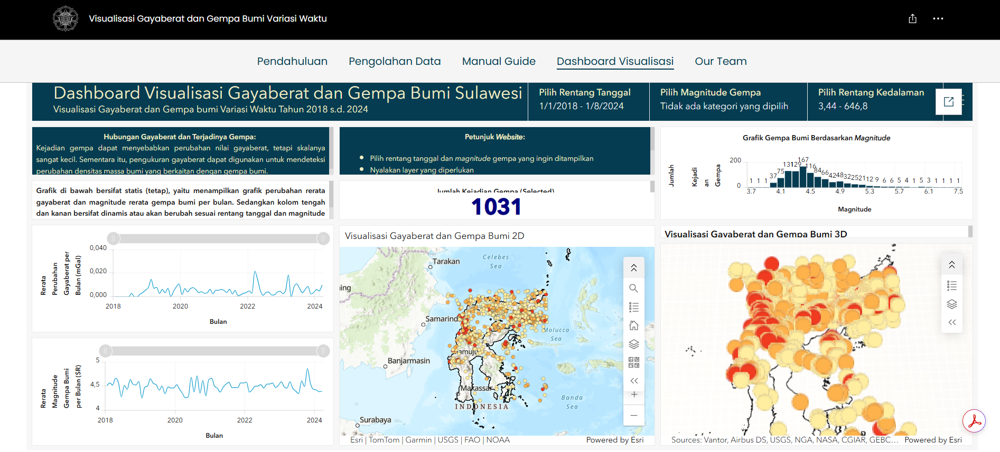

# 📡 Temporal Gravity Variation Dashboard

An interactive web-based dashboard for visualizing time-varying gravity
measurements across multiple monitoring stations, built with ArcGIS StoryMaps
and ArcGIS Online.

## ✨ Overview
This project visualizes how gravity values change over time at each station,
enabling identification of temporal anomalies and spatial patterns
across the monitoring network.

Key features:
- Interactive time-series visualization per station
- Spatial distribution map of monitoring stations
- Temporal trend analysis across observation periods

## 🖼️ Preview

## 🔗 Live Dashboard
[▶ View StoryMap](https://bit.ly/StoryMapsVisualisasiGayaBerat)

## 📦 Data
| Source | Type | Description |
|--------|------|-------------|
| Gravity monitoring stations | Time-series tabular | Periodic gravity measurements |
| Station coordinates | Point vector | Spatial location of each station |

## ⚙️ Methodology
1. Data collection from gravity monitoring stations
2. Temporal aggregation & normalization per station
3. Time-series chart construction per observation point
4. Spatial mapping of stations with ArcGIS Online
5. Dashboard assembly & narrative in ArcGIS StoryMaps

## 🛠️ Tools
- ArcGIS StoryMaps
- ArcGIS Online
- Microsoft Excel (data preprocessing)
